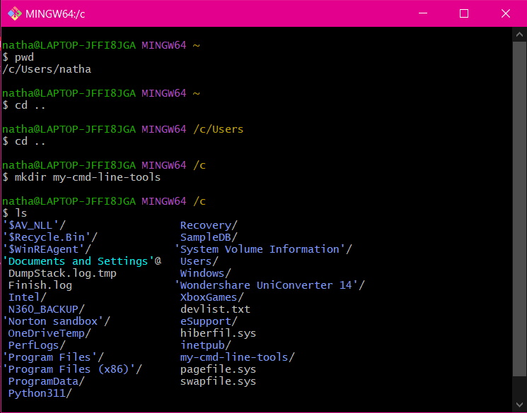
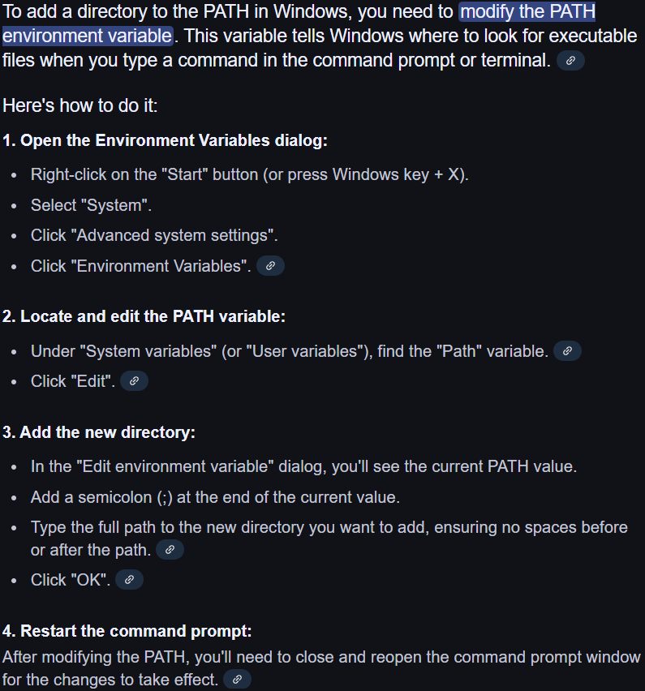

# Task: Install Terraform
1. Create a new folder for my terraform learning 
   - Here we are! `C:\Users\natha\OneDrive\Documents\Github\tech504_terraform`
2. Install Terraform
   - Installed the windows AMD64 binary from [https://developer.hashicorp.com/terraform/install](https://developer.hashicorp.com/terraform/install)
   - Created a new folder for command line tools 
   - Unzipped the terraform binary into that folder
   - (Deleted the license doc for tidiness)
1. Test with `terraform --version`
   - This didn't work at first, because I forgot a step when I made the folder for command line tools! 
     - The folder needs to be added to the PATH! 
   - Works now
2. Add the Terraform extension to VScode
   - yep